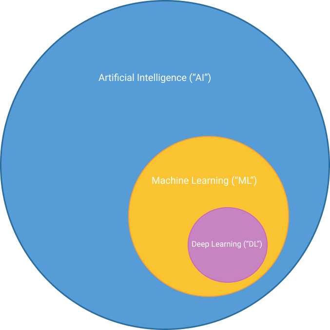

import { Blockquote, Definition, Note } from '$styles';
import { colors } from 'gatsby-theme-apollo-core';

## What is data science?  
<h4 style={{
  color: colors.primary
}}>
Data science is a tool that solves certain problems.</h4>

There's a real temptation to think of data science as a magical cure-all—as in, "If we could just data science real good, we'd win."

It solves some problems better, faster and more cost-effectively than other tools and may be the only tool that can solve particular problems, but, from a product manager's perspective, the most important thing to remember about data science is that it is a tool that solves certain problems. 

Like other tools, to make effective use of data science, it must be applied to the correct problem. Most data scientists will readily admit that, particularly in a commercial context, identifying and clearly defining the problem to be solved and setting metrics for measuring acceptable results is more difficult and time-consuming than developing an effective model.

<Note>
Data science is relatively new and evolving quickly. The taxonomy and terms of art are unsettled. Universities are rapidly creating data science degrees to meet industry demand for skilled data scientists. Some schools have chosen to add data science curriculum to their statistics departments. Others have added it to their computer science schools. If an article or book classifies something or uses a term in a way that is slightly different than you've come to expect, it probably isn't you.
</Note>
 

Despite the note above, the diagram below is widely accepted and useful.

 

 
 
<Definition>
  <strong>Artificial Intelligence:</strong> A program that can sense, reason, act and adapt.    
  <strong>Machine Learning:</strong> Algorithms whose performance improve as they are exposed to more data over time. 
  <strong>Deep Learning:</strong> Subset of machine learning in which multilayered neural networks learn from vast amounts of data.
</Definition>

Today, data science is primarily conducted within the Machine Learning sphere in the diagram above. Before we dive fully into that Machine Learning sphere for the remainder of this site, it's worth making a note of [OpenAI](https://openai.com/). OpenAI's mission "is to ensure that artificial general intelligence (AGI) benefits all of humanity, primarily by attempting to build safe AGI and share the benefits with the world." OpenAI was founded by Elon Musk, Sam Altman and other prominent Silicon Valley dwellers. Musk left the board in early 2018.  

Unless otherwise noted, this site will deal only with topics that fit wholly within the machine learning sphere, and its subset, deep learning.

## How does it work?  
Machine learning is the process of finding the best _algorithm_ to create a _model_ that transforms input into desired output.

"Machine Learning" is poorly named; there is no learning. When an animal learns something, it's able to use what it has learned to notice if and when circumstances change and how to change its behavior in response. That is not the case with a machine learning model. The model is created to fit very precisely to the data that was used to create it. If it encounters data that differs from the data used to create the model, it cannot adjust. Its performance will simply degrade. Digging a little deeper into how machine learning models are created will reveal why this is. Let's take an email spam filter as an example. 

### 1. Define the problem to be solved
In this case, the problem is clear and doesn't require much exploration. Users' inboxes are being flooded with unwanted emails. We can make our users happier by accurately diverting spam email into a junk folder, thus alleviating the burden of wading through unwanted email. Filtering spam from _ham_ is a _binary classification_ problem. Emails are the elements that will be classified into one of two groups--- spam or ham.  

### 2. Set success metrics
We set measurable goals in advance so we all know what we're working towards and when we've reached our goal. In this case, we've agreed upon the following:
- fewer than 5% of the email that makes it to a user's inbox is spam, and  
- fewer than 5% of ham is wrongly diverted to the junk folder.

We've decided to make this a competition between Oscar, our object-oriented programming guru, and Melissa, our machine learning intern.

Oscar takes a traditional _OOP_ approach. He begins by looking at the bodies of the emails for words or phrases that are common to spam emails and add rules to mark emails containing these words and phrases as spam. Oscar then moves on to the email metadata and adds rules for email addresses that frequently send spam and subject lines containing words like "special offer". You can imagine that the number of rules is becoming increasingly unwieldy and brittle by this point. Now, spam senders are catching on to the fact that their emails are no longer getting through. In order to get their spam past this filter, they start using new email addresses and their subject lines now contain "s p e c i a l   o f f e r", instead of "special offer". Oscar gets back to work, adding new rules for each new variant.

### 3. Segment & explore the data
Melissa takes a fundamentally different approach. She begins by collecting 50,000 emails that have been identified and marked as either "spam" or "ham". Ideally, about 50% of the emails she collects are spam.

She immediately creates a _test set_ by setting aside 20% of the emails to be used later to test promising models. The remaining 40,000 emails will be used to train and validate models.

After separating the data, Melissa begins her exploratory data analysis ("EDA"). During EDA, she will look at the data set's _features_, such as the length, the number and types of attachments, frequency of certain words, correlation between features, etc. She'll also look for outliers, or data that doesn't seem to fit or make sense. A product manager's domain knowledge could be very valuable during this phase. If this were a domain-specific problem, Melissa's product manager should be spending time with her to review her findings and offer domain-specific insights to help guide Melissa through the next steps of her project.  

### 4. Prepare the data
At this stage, Melissa may choose to transform some of the features in ways that will make them more accessible to the algorithms Melissa chooses to use, and to increase the accuracy of the models she builds. Melissa might choose to drop features, such as fields from the email metadata, that are unlikely to provide any insight into whether an email is ham or spam and will just add noise to the model. She should also decide what to do with any outliers she found and how she's going to deal with missing data.

Our spam filter example is not the best example to illustrate this phase of the project, because working with text is fundamentally different than working with numbers. In a numbers-heavy machine learning project, the data scientist might choose to square, or take the log of or square root of a feature, standardize or normalize some features or aggregate one or more features into a new feature.
 
The algorithm would then create a model that embodied its findings. The data scientist would feed the remaining emails through the model created and look at performance metrics, such as:  
  
  1. How many ham emails were correctly marked ham?  
  2. How many spam emails were mistakenly marked ham?  
  3. How many spam emails were correctly marked spam?  
  4. How many ham emails were mistakenly marked spam?  

### 5. Evaluate the models and shortlist the most promising

### 6. Refine the top performers
  
She would likely repeat these steps with additional algorithms, looking for the best out-of-the-box performance. If any of the algorithms produced models whose performance approached her pre-established goals, she might choose one or two of them for further refinements. Finally, she would test the refined model or models on the 10,000 emails she had initially set aside for final testing. The model's performance on this final set of previously unseen emails is the best measure of its ability to filter spam from ham. 

It's important to note that once her spam filtering model is in production, she must continue to monitor its performance from time-to-time. Models tend to "drift", or lose accuracy over time. In this instance, you can imagine that spam senders will be looking for new ways to thwart the filter and the filter will need to be updated occasionally to account for these new tactics.
  
The most important takeaways:
- Melissa did not write any rules herself; the algorithm generated rules after being given labeled data (emails marked as ham or spam)
- the problem to be solved was clearly defined in advance  
- the metrics required for a proposed solution to be deemed a success were clearly defined in advance  
- the emails were generally representative of future emails that the model would be asked to mark as spam or ham  
- upon receipt of the full data set, the data scientist immediately set aside 10,000 of the emails for final testing (the "test set", generally 20-30% of the total)   
  - of the remaining 40,000 emails, 30,000 were used to build models (the "training set")  
  - and the other 10,000 emails were used to validate the models (the "validation set")  

## Why would I use it?  