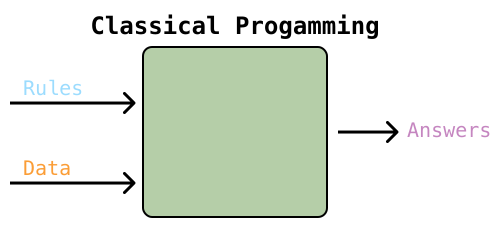

import { Blockquote, Definition, Note } from '$styles';
import { colors } from 'gatsby-theme-apollo-core';

## What is data science?  
<h4 style={{
  color: colors.primary
}}>
Data science is a set of methodologies for using data to draw meaningful conclusions that describe the present or predict the future.</h4>

Data scientists write code to leverage the speed and power of computers to apply principles of statistics, probability, linear algebra and calculus to data in order to derive useful insights. An understanding of the domain in which they are operating is also critical to the data scientist’s success. A product manager can add real value to a data science project by sharing with the data science team her understanding of the product, the problems it is designed to solve and the broader domain in which the product sits.

Data science and artificial intelligence arose from very different origins but have come to be used interchangeably in many contexts. Artificial intelligence began in earnest in the 1950s as an attempt to create computers that could be made to “think” in the way humans do. Today, this is known as Artificial General Intelligence (or, “AGI”). Terms like “singularity” and the “Turing test” apply to AGI.

"Data science" was first used in the mid-1990s to refer to the 3-part process of (i) data collection, (ii) data modeling and analysis, and (iii) decision making. C.F. Jeff Wu proposed that statistics be renamed “data science” and statisticians “data scientists”. This usage did not catch on. In the 2000s, data science gradually came to represent the extension of the field of statistics to incorporate advances in computing with data.

Today, data science is most often used to refer to the study and application of machine learning and deep learning, two subfields of artificial intelligence. For instance, PwC regularly uses “AI” as shorthand for machine learning (“ML”) and deep learning (“DL”), the provenance of data science.
 

 

Today, data science is primarily conducted within the Machine Learning sphere in the diagram above. Before we dive fully into that Machine Learning sphere for the remainder of this site, it's worth making a note of [OpenAI](https://openai.com/). OpenAI's mission "is to ensure that artificial general intelligence (AGI) benefits all of humanity, primarily by attempting to build safe AGI and share the benefits with the world." OpenAI was founded by Elon Musk, Sam Altman and other prominent Silicon Valley dwellers. Musk left the board in early 2018.  

Unless otherwise noted, this site will deal only with topics that fit wholly within the machine learning sphere, and its subset, deep learning.

<Note>
Data science is relatively new and evolving quickly. The taxonomy and terms of art are unsettled. Universities are rapidly creating data science degrees to meet industry demand for skilled data scientists. Some schools have chosen to add data science curriculum to their statistics departments. Others have added it to their computer science schools. If an article or book classifies something or uses a term in a way that is slightly different than you've come to expect, it probably isn't you.
</Note>

## How does it work?  

Classical programming takes rules and data as inputs and generates answers.

A calculator is a simple example. A calculator takes data supplied by the user (2 + 7), applies the rules of addition it was programmed to follow, and returns the answer, 9. This was in fact the dominant paradigm for AI from the 1950s - 1980s. Known as symbolic AI, experts believed that they could automate intellectual tasks normally performed by humans by handcrafting a sufficiently large set of explicit rules. While this approach was sufficient for crafting chess opponents, it was abandoned in the 1980s when it became generally accepted that this approach would not be capable of tasks such as image classification, speech recognition and language translation.

Conversely, machine learning takes data and answers as input and generates rules. These rules are referred to as a model.

As an example, let's look at predicting the price of housing. The hello world of data science is a dataset using data about housing prices in Boston in the 1970s. There are 506 homes in the dataset. The following information is provided for each home:

| Abbr. | Description |
| :-- | :-- |
| CRIM | per capita crime rate by town |
| ZN | proportion of residential land zoned for lots over 25,000 sq. ft. |
| INDUS | proportion of non-retail business acres per town |
| CHAS | 1 if tract bounds river; 0 otherwise |
| NOX | nitric oxides concentration (parts per million) |
| RM | average number of rooms per dwelling |
| AGE | proportion of owner-occupied units built prior to 1940 |
| DIS | weighted distances to five Boston employment centers |
| RAD | index of accessibility to radial highways | 
| TAX | full value property-tax rate per $10,000 |
| PTRATIO | pupil-teacher ratio by town | 
| B | 1000(Bk - 0.63)^2 where Bk is the proportion of blacks by town |
| LSTAT | % lower status of the population |
| MEDV | median value of owner-occupied home in $1,000s | 
  
The first five rows of the dataset look like this:  

 

## Why would I use it?  

| | 2019 | 2020 | change |
| :-- | --: | --: | --: |
| Investigating use of AI | 22% | 42% | +91% | 
| Implemented pilot project | 16% | 23% | +44% |
| Plan to deploy in multiple areas | 15% | 13% | -13% |
| Already implemented AI in multiple areas | 27% | 18% | -33% |
| Plan to deploy AI enterprise-wide | 20% | 4% | -80% |

<a style={{
  fontSize: '13px',
  color: colors.text3,
  marginTop: 0,
}}
href='https://www.pwc.com/us/en/services/consulting/library/artificial-intelligence-predictions-2020.html?WT.mc_id=CT11-PL1000-DM2-TR1-LS4-ND4-TTA9-'>AI Predictions 2020: PWC</a>
 
<a style={{
  fontSize: '13px',
  color: colors.text3,
  marginTop: 0,
}}
href='https://www.pwc.com/us/en/services/consulting/library/artificial-intelligence-predictions-2019.html'>2019 AI Predictions: PWC</a>